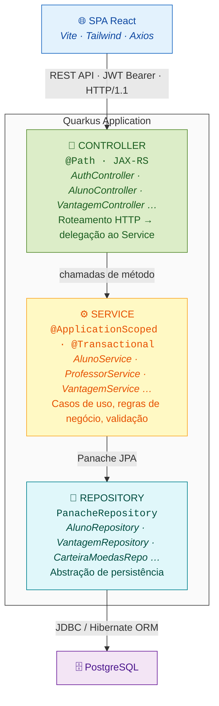
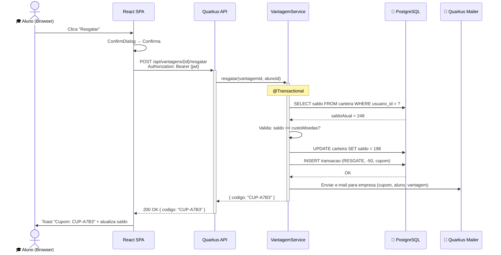

# 🎓 StudentPay — Sistema de Moeda Estudantil

> **Plataforma Web de reconhecimento acadêmico via moeda virtual**
> Professores distribuem moedas como recompensa por mérito — alunos trocam por vantagens de empresas parceiras — tudo via Internet.

<table>
  <tr>
    <td width="820px">
      <div align="justify">
        O <b>StudentPay</b> é um sistema web fullstack desenvolvido em <b>Java 21 + Quarkus 3</b> (backend) e <b>React 19 + Vite 6</b> (frontend) com arquitetura <b>MVC em camadas</b>. O projeto modela o ciclo completo de uma economia de moedas estudantis: do crédito semestral ao professor, passando pelo envio de moedas como reconhecimento, até o resgate de vantagens pelo aluno com geração de cupom. O sistema segue princípios de <i>Clean Architecture</i>, <i>Domain-Driven Design</i> e autenticação stateless via JWT.
      </div>
    </td>
    <td>
      <div align="center">
        🪙<br/>
        <sub><b>StudentPay</b><br/>PUC Minas · ES</sub>
      </div>
    </td>
  </tr>
</table>

---

## 🚧 Status do Projeto


[](./)


---

## 📚 Índice

- [Sobre o Projeto](#-sobre-o-projeto)
- [Funcionalidades Principais](#-funcionalidades-principais)
- [Arquitetura](#-arquitetura)
  - [Visão em Camadas (MVC)](#visão-em-camadas-mvc)
  - [Modelo de Domínio](#modelo-de-domínio)
  - [Estratégia de Herança JPA](#estratégia-de-herança-jpa)
  - [Fluxo de Dados](#fluxo-de-dados-end-to-end)
  - [Segurança](#segurança)
- [Tecnologias Utilizadas](#-tecnologias-utilizadas)
- [Estrutura do Projeto](#-estrutura-do-projeto)
- [Instalação e Execução](#-instalação-e-execução)
- [Dados de Teste (Seed)](#-dados-de-teste-seed)
- [Diagramas](#-diagramas)
- [Roadmap de Sprints](#-roadmap-de-sprints)
- [Equipe](#-equipe)
- [Referências Técnicas](#-referências-técnicas)
- [Licença](#-licença)

---

## 🎯 Sobre o Projeto

O sistema foi concebido para atender às necessidades de **três tipos de atores**:

| Ator | Papel no Sistema |
|------|-----------------|
| **Aluno** (pessoa física) | Cadastra-se, recebe moedas de professores, resgata vantagens |
| **Professor** | Recebe crédito semestral de 1.000 moedas, distribui como reconhecimento de mérito |
| **Empresa Parceira** | Cadastra vantagens (descontos, produtos), é notificada por e-mail a cada resgate |

> **Caso de uso central:** Um professor autenticado seleciona um aluno e envia moedas com justificativa → o saldo do aluno é creditado → o aluno navega as vantagens disponíveis → resgata uma vantagem → o sistema debita as moedas, gera um cupom único e notifica a empresa parceira por e-mail.

---

## ✨ Funcionalidades Principais

- [x] Cadastro e autenticação de alunos, professores e empresas parceiras (JWT)
- [x] Crédito semestral automático de 1.000 moedas por professor (acumulável)
- [x] Envio de moedas professor → aluno com motivo obrigatório
- [x] Notificação por e-mail em HTML (Qute) com templates dedicados: **comprovante para o professor** e **recebimento para o aluno**
- [x] CRUD de vantagens por empresa parceira (descrição, foto, custo em moedas)
- [x] Resgate de vantagens com geração de cupom único e notificação por e-mail
- [x] Extrato completo de transações (envios, resgates, créditos)
- [x] Consulta de saldo em tempo real
- [x] Frontend responsivo com design system próprio (Tailwind CSS 4)

---

## 🏗️ Arquitetura

### Visão em Camadas (MVC)



### Modelo de Domínio

| Entidade | Responsabilidade | Atributos-chave |
|----------|-----------------|-----------------|
| `Usuario` | Raiz abstrata de autenticação | `id`, `email`, `login`, `senhaHash`, `tipoUsuario` |
| `Aluno` | Estudante que recebe/gasta moedas | `cpf`, `rg`, `matricula`, `instituicao`, `curso`, `endereco` |
| `Professor` | Docente que distribui moedas | `cpf`, `departamento`, `instituicao`, `semestre` |
| `EmpresaParceira` | Empresa que oferece vantagens | `cnpj`, `nomeFantasia`, `site` |
| `CarteiraMoedas` | Saldo de moedas do usuário | `saldoAtual`, `usuario` |
| `TransacaoMoeda` | Registro de movimentação (abstrata) | `quantidade`, `dataHora`, `descricao` |
| `EnvioMoedas` | Transferência professor → aluno | `motivo`, `professor`, `aluno` |
| `CreditoSemestral` | Crédito automático por semestre | `semestre`, `professor` |
| `ResgateVantagem` | Troca de moedas por vantagem | `cupom`, `status`, `aluno`, `vantagem` |
| `Vantagem` | Oferta de empresa parceira | `descricao`, `fotoUrl`, `custoMoedas`, `empresa`, `ativa` |
| `InstituicaoEnsino` | Universidade | `nome`, `cursos` |
| `Curso` | Curso vinculado a instituição | `nome`, `instituicao` |
| `Semestre` | Período letivo | `ano`, `periodo`, `inicio`, `fim` |

### Estratégia de Herança JPA

| Hierarquia | Estratégia | Justificativa |
|-----------|-----------|---------------|
| `Usuario` → `Aluno`, `Professor`, `EmpresaParceira` | **JOINED** | Cada subtipo tem muitos atributos próprios. JOINED evita colunas nulas e mantém normalização. |
| `TransacaoMoeda` → `EnvioMoedas`, `CreditoSemestral`, `ResgateVantagem` | **SINGLE_TABLE** | Transações são consultadas em massa (extrato). SINGLE_TABLE evita JOINs custosos e usa discriminator column. |

### Fluxo de Dados (end-to-end)



### Segurança

| Camada | Mecanismo | Justificativa |
|--------|-----------|---------------|
| **Autenticação** | JWT (SmallRye JWT) | Stateless — escala horizontalmente sem sessão no servidor |
| **Autorização** | Claims no JWT (`tipoUsuario`) | Endpoints filtram por tipo: aluno, professor, empresa |
| **Senhas** | BCrypt (fator ≥ 10) | Hashing adaptativo resistente a brute-force (NIST SP 800-63B) |
| **CORS** | Origins explícitas em `application.properties` | Apenas o frontend local autorizado |
| **Interceptor 401** | Axios response interceptor | Token expirado → redirect automático para login |

---

## 🛠️ Tecnologias Utilizadas

| Tecnologia | Versão | Papel |
|-----------|--------|-------|
| Java | 21 (LTS) | Linguagem principal |
| Quarkus | 3.17.8 | Framework backend (IoC, HTTP, JPA, JWT, Mailer) |
| Hibernate ORM + Panache | — | Mapeamento objeto-relacional + repositórios simplificados |
| RESTEasy (JAX-RS) | — | Camada REST |
| SmallRye JWT | — | Autenticação stateless |
| Quarkus Mailer | — | Notificações por e-mail |
| Qute | — | Templates HTML type-safe de e-mail (`@CheckedTemplate`) |
| PostgreSQL | 16+ | Banco relacional (Dev Services via container) |
| React | 19.0.0 | UI declarativa |
| Vite | 6.3.1 | Build tool + dev server |
| Tailwind CSS | 4.2.4 | Design system utility-first |
| React Router DOM | 7.6.1 | Roteamento SPA |
| Axios | 1.9.0 | HTTP client |
| Lucide React | 1.14.0 | Iconografia |
| Sonner | 2.0.7 | Toast notifications |
| Inter | 5.2.8 | Tipografia (@fontsource) |

---

## 📁 Estrutura do Projeto

```
studentpay/
├── backend/                           # API Quarkus (Java 21)
│   ├── src/main/java/com/studentpay/
│   │   ├── controller/                # REST endpoints (6 controllers)
│   │   │   ├── AuthController.java
│   │   │   ├── AlunoController.java
│   │   │   ├── ProfessorController.java
│   │   │   ├── EmpresaParceiraController.java
│   │   │   ├── VantagemController.java
│   │   │   └── InstituicaoController.java
│   │   ├── service/                   # Lógica de negócio
│   │   ├── model/                     # Entidades JPA
│   │   │   ├── Usuario.java           # @Entity abstrata (JOINED)
│   │   │   ├── Aluno.java
│   │   │   ├── Professor.java
│   │   │   ├── EmpresaParceira.java
│   │   │   ├── CarteiraMoedas.java
│   │   │   ├── TransacaoMoeda.java    # @Entity abstrata (SINGLE_TABLE)
│   │   │   ├── EnvioMoedas.java
│   │   │   ├── CreditoSemestral.java
│   │   │   ├── ResgateVantagem.java
│   │   │   └── Vantagem.java
│   │   ├── repository/                # Panache repositories (9 repos)
│   │   ├── dto/                       # Request/Response DTOs
│   │   └── config/                    # GlobalExceptionMapper
│   └── src/main/resources/
│       ├── application.properties
│       ├── import.sql                 # Seed data
│       └── templates/emails/          # Templates HTML de e-mail (Qute)
│           ├── envioMoedasAluno.html       # recebimento → aluno
│           ├── envioMoedasProfessor.html   # comprovante → professor
│           ├── resgateAluno.html           # cupom → aluno
│           └── resgateEmpresa.html         # conferência → empresa
├── frontend/                          # SPA React 19 (Vite 6)
│   └── src/
│       ├── components/
│       │   ├── ui/                    # Design system (8 componentes)
│       │   │   ├── Button.jsx         # Variantes: primary, secondary, ghost, danger
│       │   │   ├── Input.jsx          # Label auto-linked (useId), error state
│       │   │   ├── Select.jsx         # Searchable quando >10 opções
│       │   │   ├── DataTable.jsx      # Responsivo (stack mobile)
│       │   │   ├── StatCard.jsx       # Animação de contagem, variante gradient
│       │   │   ├── Skeleton.jsx       # Shimmer loading (4 variantes)
│       │   │   ├── EmptyState.jsx     # Ícone + copy + CTA
│       │   │   └── ConfirmDialog.jsx  # Focus trap, Escape, aria-modal
│       │   ├── layout/                # App shell
│       │   │   ├── AppLayout.jsx      # Sidebar + main content
│       │   │   ├── Navbar.jsx         # (legado, mantido como ref)
│       │   │   └── PageHeader.jsx     # Título + subtitle + actions
│       │   └── domain/                # Componentes de negócio
│       │       ├── VantagemCard.jsx   # Card com imagem, preço, botão
│       │       ├── ExtratoTable.jsx   # Cores semânticas por tipo
│       │       └── EnviarMoedasForm.jsx # Select searchable + validação
│       ├── pages/                     # 6 telas
│       │   ├── Login.jsx              # Fullscreen split layout
│       │   ├── CadastroAluno.jsx      # Fullscreen sidebar + grid form
│       │   ├── CadastroEmpresa.jsx    # Fullscreen split layout
│       │   ├── DashboardAluno.jsx     # StatCards + VantagemGrid + Extrato
│       │   ├── DashboardProfessor.jsx # StatCards + EnviarMoedas + Extrato
│       │   └── DashboardEmpresa.jsx   # DataTable + CRUD form
│       ├── context/AuthContext.jsx     # JWT + localStorage
│       ├── services/api.js            # Axios + interceptor 401
│       └── styles/globals.css         # Tokens + reset + animations
├── diagrams/                          # Diagramas UML e ER
│   ├── use_cases_diagram_2.0.png
│   ├── uc_diagram_description.md
│   ├── user_stories.md
│   ├── class_diagram.md
│   ├── class_diagram_description.md
│   ├── component_diagram.md
│   ├── er_conceptual.md
│   ├── er_diagram.md
│   ├── sequence_diagrams_uc.md        # Índice — 1 diagrama por caso de uso
│   ├── sequence_diagram.md            # Diagrama de Sequência Geral
│   └── sequence/                      # Fontes PlantUML (.puml) + PNG/SVG (out/)
├── docs/                              # Documentação adicional
└── README.md
```

---

## ⚙️ Instalação e Execução

### Pré-requisitos

| Ferramenta | Versão mínima | Verificação |
|-----------|--------------|-------------|
| JDK | 21 | `java -version` |
| Maven | 3.9 | `mvn -version` |
| Node.js | 20 | `node -v` |
| Docker/Podman | — | Para PostgreSQL via Dev Services |

### 🐳 Execução com Docker (recomendado)

Requer **Docker + Docker Compose**. Um único comando sobe banco, backend, frontend e o servidor de e-mail (Mailpit):

```bash
make up           # equivale a: docker compose up -d --build
```

| Serviço | URL |
|---------|-----|
| Frontend (SPA) | http://localhost:5173 |
| Backend (API) | http://localhost:8080 |
| **Mailpit** (caixa de e-mails) | http://localhost:8025 |

Com o Mailpit, os e-mails de **envio de moedas** (aluno + professor) e de **resgate** (aluno + empresa) ficam visíveis no navegador. Outros atalhos:

```bash
make logs         # acompanha os logs
make down         # derruba os serviços (mantém o banco)
make clean        # derruba e apaga o volume do banco
make help         # lista todos os alvos
```

### Backend

```bash
cd backend

# Quarkus Dev Services sobe PostgreSQL automaticamente em container
./mvnw quarkus:dev

# API disponível em http://localhost:8080
```

### Frontend

```bash
cd frontend
npm install
npm run dev

# SPA disponível em http://localhost:5175
```

---

## 🧪 Dados de Teste (Seed)

O `import.sql` popula o banco com dados prontos para uso:

| Tipo | Login | Senha | Detalhes |
|------|-------|-------|----------|
| Professor | `joao.aramuni` | `prof123` | PUC Minas · 1.000 moedas |
| Professor | `maria.silva` | `prof123` | UFMG · 1.000 moedas |
| Aluno | `victor.gabriel` | `aluno123` | Eng. Software · PUC Minas |
| Aluno | `ana.souza` | `aluno123` | Ciência da Computação · PUC Minas |
| Aluno | `pedro.lima` | `aluno123` | Ciência da Computação · UFMG |
| Empresa | `techbh` | `empresa123` | TechBH · 2 vantagens |
| Empresa | `pageone` | `empresa123` | PageOne Livraria · 2 vantagens |

**Instituições:** PUC Minas, UFMG, UNA (com cursos vinculados)
**Vantagens:** 4 pré-cadastradas (descontos TechBH + livros PageOne)

---

## 📐 Diagramas

Todos os diagramas estão na pasta [`diagrams/`](./diagrams/):

| Diagrama | Arquivo | Formato |
|----------|---------|---------|
| Casos de Uso | `use_cases_diagram_2.0.png` + `uc_diagram_description.md` | PNG + Markdown |
| Histórias de Usuário | `user_stories.md` | Markdown |
| Classes | `class_diagram.md` + `class_diagram_description.md` | Mermaid |
| Componentes | `component_diagram.md` | Mermaid |
| ER Conceitual | `er_conceptual.md` | Mermaid |
| ER Relacional | `er_diagram.md` | Mermaid |
| **Sequência (por caso de uso)** | `sequence_diagrams_uc.md` + `sequence/*.puml` | **PlantUML** (PNG/SVG) |
| **Sequência Geral** | `sequence_diagram.md` + `sequence/geral.puml` | **PlantUML** (PNG/SVG) |

---

## 🗺️ Roadmap de Sprints

### Release 01 — Modelagem e CRUDs base

| Sprint | Entregáveis | Status |
|--------|-------------|--------|
| **Lab03S01** | Diagrama de Casos de Uso · Histórias de Usuário · Diagrama de Classes · Diagrama de Componentes | ✅ Concluída |
| **Lab03S02** | Modelo ER · Estratégia ORM (Hibernate/Panache) · CRUDs de Aluno e Empresa (front + back) · Autenticação JWT | ✅ Concluída |
| **Lab03S03** | CRUDs de Aluno e Empresa (versão final) · apresentação da arquitetura e camada de persistência | ✅ Concluída |

### Release 02 — Casos de uso transacionais

| Sprint | Entregáveis | Status |
|--------|-------------|--------|
| **Lab04S01** | Envio de moedas · Consulta de extrato (professor e aluno) · **E-mails de confirmação** (template para professor + template para aluno) | ✅ Concluída |
| **Lab04S02** | **Diagramas de Sequência** (um por caso de uso, em PlantUML) · Cadastro de vantagens (empresa) · Listagem de vantagens (aluno) | ✅ Concluída |
| **Lab04S03** | Diagrama de Sequência Geral · Troca de vantagens (resgate pelo aluno) | ✅ Concluída |

---

## 👤 Equipe

| Nome | GitHub |
|------|--------|
| Victor Gabriel Santos Rocha | [@santwsvi](https://github.com/santwsvi) |

---

## 📖 Referências Técnicas

- **Martin, R.C.** (2017). *Clean Architecture: A Craftsman's Guide to Software Structure and Design*. Prentice Hall.
- **Evans, E.** (2003). *Domain-Driven Design: Tackling Complexity in the Heart of Software*. Addison-Wesley.
- **Fowler, M.** (2002). *Patterns of Enterprise Application Architecture*. Addison-Wesley.
- **NIST SP 800-63B** — Digital Identity Guidelines: Authentication and Lifecycle Management.
- **Quarkus Documentation** — https://quarkus.io/guides/
- **Tailwind CSS v4** — https://tailwindcss.com/docs
- **React 19** — https://react.dev/

---

## 📄 Licença

Este projeto é desenvolvido para fins acadêmicos no curso de **Engenharia de Software — PUC Minas**.
Disciplina: **Laboratório de Desenvolvimento de Software**
Professor: **João Paulo Carneiro Aramuni**

---

<div align="center">
  Feito com ☕ e 🪙 por Victor Gabriel · PUC Minas · 2026
</div>
