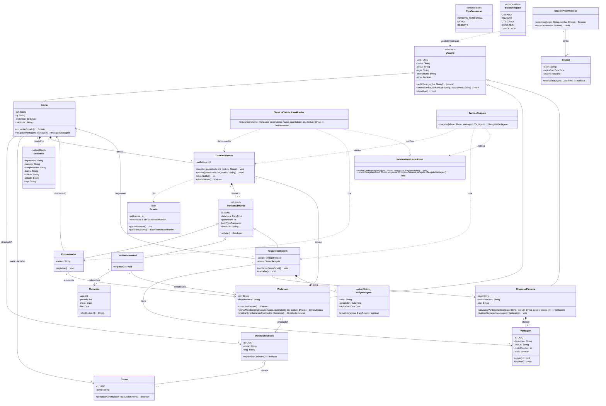

```mermaid
classDiagram
direction TB

class Usuario {
  <<abstract>>
  -uuid: UUID
  -nome: String
  -email: String
  -login: String
  -senhaHash: String
  -ativo: boolean
  +autenticar(senha: String): boolean
  +alterarSenha(senhaAtual: String, novaSenha: String): void
  +desativar(): void
}

class Aluno {
  -cpf: String
  -rg: String
  -endereco: Endereco
  -matricula: String
  +consultarExtrato(): Extrato
  +resgatar(vantagem: Vantagem): ResgateVantagem
}

class Professor {
  -cpf: String
  -departamento: String
  +consultarExtrato(): Extrato
  +enviarMoedas(destinatario: Aluno, quantidade: int, motivo: String): EnvioMoedas
  +creditarCotaSemestral(semestre: Semestre): CreditoSemestral
}

class EmpresaParceira {
  -cnpj: String
  -nomeFantasia: String
  -site: String
  +cadastrarVantagem(descricao: String, fotoUrl: String, custoMoedas: int): Vantagem
  +inativarVantagem(vantagem: Vantagem): void
}

Usuario <|-- Aluno
Usuario <|-- Professor
Usuario <|-- EmpresaParceira

class InstituicaoEnsino {
  -id: UUID
  -nome: String
  -cnpj: String
  +validarPreCadastro(): boolean
}

class Curso {
  -id: UUID
  -nome: String
  +pertenceA(instituicao: InstituicaoEnsino): boolean
}

InstituicaoEnsino "1" o-- "0..*" Curso : oferece
Aluno "1" --> "1" InstituicaoEnsino : vinculadoA
Aluno "1" --> "1" Curso : matriculadoEm
Professor "1" --> "1" InstituicaoEnsino : vinculadoA

class Endereco {
  <<valueObject>>
  -logradouro: String
  -numero: String
  -complemento: String
  -bairro: String
  -cidade: String
  -estado: String
  -cep: String
}

Aluno "1" *-- "1" Endereco : resideEm

class CarteiraMoedas {
  -saldoAtual: int
  +creditar(quantidade: int, motivo: String): void
  +debitar(quantidade: int, motivo: String): void
  +obterSaldo(): int
  +obterExtrato(): Extrato
}

Aluno "1" *-- "1" CarteiraMoedas : possui
Professor "1" *-- "1" CarteiraMoedas : possui

class Extrato {
  <<dto>>
  -saldoAtual: int
  -transacoes: List~TransacaoMoeda~
  +getSaldoAtual(): int
  +getTransacoes(): List~TransacaoMoeda~
}

CarteiraMoedas ..> Extrato : cria

class TransacaoMoeda {
  <<abstract>>
  -id: UUID
  -dataHora: DateTime
  -quantidade: int
  -tipo: TipoTransacao
  -descricao: String
  +validar(): boolean
}

class EnvioMoedas {
  -motivo: String
  +registrar(): void
}

class CreditoSemestral {
  +registrar(): void
}

class ResgateVantagem {
  -codigo: CodigoResgate
  -status: StatusResgate
  +confirmarEnvioEmail(): void
  +cancelar(): void
}

TransacaoMoeda <|-- EnvioMoedas
TransacaoMoeda <|-- CreditoSemestral
TransacaoMoeda <|-- ResgateVantagem

CarteiraMoedas "1" *-- "0..*" TransacaoMoeda : historico

EnvioMoedas "1" --> "1" Professor : remetente
EnvioMoedas "1" --> "1" Aluno : destinatario

class Semestre {
  -ano: int
  -periodo: int
  -inicio: Date
  -fim: Date
  +identificador(): String
}

CreditoSemestral "1" --> "1" Semestre : referenteA
CreditoSemestral "1" --> "1" Professor : beneficiario

class Vantagem {
  -id: UUID
  -descricao: String
  -fotoUrl: String
  -custoMoedas: int
  -ativa: boolean
  +ativar(): void
  +inativar(): void
}

EmpresaParceira "1" *-- "0..*" Vantagem : oferece
ResgateVantagem "1" --> "1" Aluno : resgatante
ResgateVantagem "1" --> "1" Vantagem : item
ResgateVantagem "1" --> "1" EmpresaParceira : fornecedora

class CodigoResgate {
  <<valueObject>>
  -valor: String
  -geradoEm: DateTime
  -expiraEm: DateTime
  +ehValido(agora: DateTime): boolean
}

ResgateVantagem "1" *-- "1" CodigoResgate : gera

class TipoTransacao {
  <<enumeration>>
  CREDITO_SEMESTRAL
  ENVIO
  RESGATE
}

class StatusResgate {
  <<enumeration>>
  GERADO
  ENVIADO
  UTILIZADO
  EXPIRADO
  CANCELADO
}

class ServicoAutenticacao {
  +autenticar(login: String, senha: String): Sessao
  +encerrar(sessao: Sessao): void
}

class Sessao {
  -token: String
  -expiraEm: DateTime
  -usuario: Usuario
  +estaValida(agora: DateTime): boolean
}

ServicoAutenticacao ..> Usuario : validaCredenciais
ServicoAutenticacao "1" --> "0..*" Sessao : emite

class ServicoDistribuicaoMoedas {
  +enviar(remetente: Professor, destinatario: Aluno, quantidade: int, motivo: String): EnvioMoedas
}

class ServicoResgate {
  +resgatar(aluno: Aluno, vantagem: Vantagem): ResgateVantagem
}

class ServicoNotificacaoEmail {
  +enviarGanhoMoedas(aluno: Aluno, transacao: EnvioMoedas): void
  +enviarResgate(aluno: Aluno, empresa: EmpresaParceira, resgate: ResgateVantagem): void
}

ServicoDistribuicaoMoedas ..> CarteiraMoedas : debita/credita
ServicoDistribuicaoMoedas ..> EnvioMoedas : cria
ServicoDistribuicaoMoedas ..> ServicoNotificacaoEmail : notifica

ServicoResgate ..> CarteiraMoedas : debita
ServicoResgate ..> ResgateVantagem : cria
ServicoResgate ..> ServicoNotificacaoEmail : notifica

```
