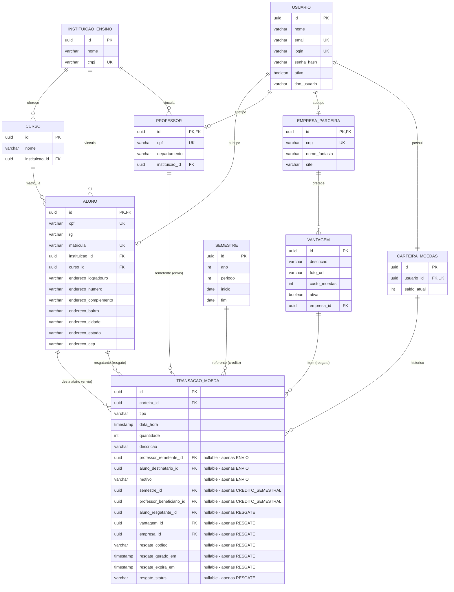

# Modelo Entidade-Relacionamento — StudentPay

## Descrição

Este diagrama representa o modelo relacional do sistema StudentPay, mapeado a partir do diagrama de classes (Release 1). A estratégia de herança adotada é **Joined Table** (`JOINED`), onde a tabela `usuarios` contém os atributos comuns e cada subtipo (aluno, professor, empresa_parceira) possui sua própria tabela com chave estrangeira para `usuarios`.

### Decisões de mapeamento

| Decisão | Justificativa |
|---|---|
| Herança JOINED | Evita colunas nulas (vs. SINGLE_TABLE), mantém integridade referencial por subtipo |
| Endereço embutido | Value Object — não tem identidade própria, fica como colunas na tabela `alunos` |
| CarteiraMoedas como tabela separada | Permite consulta independente de saldo sem carregar o usuário inteiro |
| TransacaoMoeda com discriminator | SINGLE_TABLE para transações (EnvioMoedas, CreditoSemestral, ResgateVantagem) — volume alto, queries frequentes no histórico, evita JOINs |
| CodigoResgate embutido | Value Object — colunas na própria tabela de transações (apenas para tipo RESGATE) |

---

