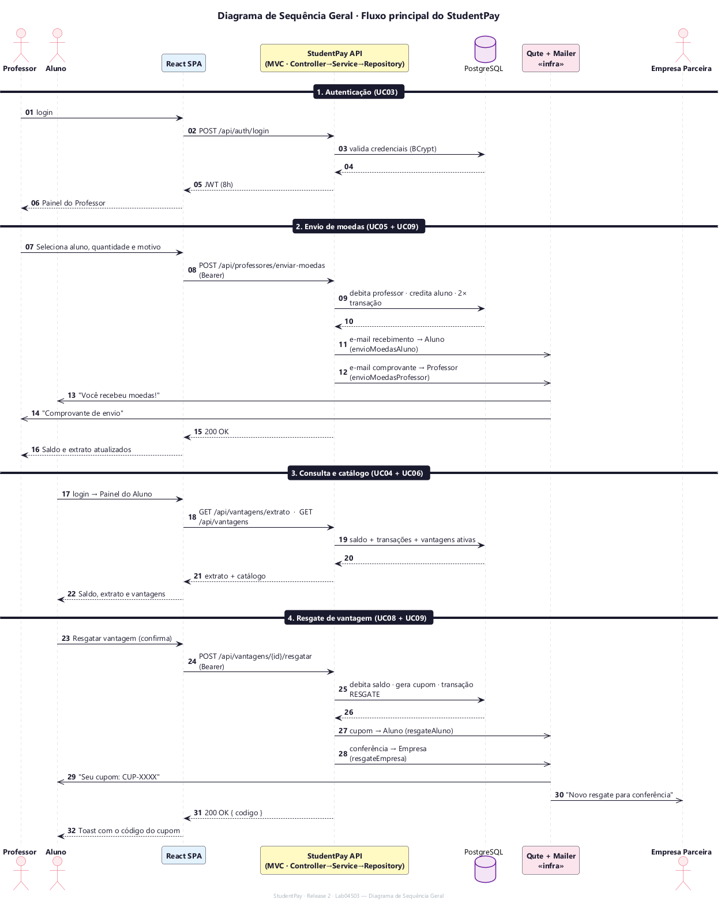

# Diagrama de Sequência Geral — StudentPay (Release 2 · Lab04S03)

Visão fim-a-fim do fluxo principal do sistema, integrando os casos de uso em
quatro fases: **autenticação → envio de moedas → consulta/catálogo → resgate**.
Modelado em **PlantUML** ([fonte](./sequence/geral.puml)).

## Fases

1. **Autenticação (UC03)** — login e emissão do JWT.
2. **Envio de moedas (UC05 + UC09)** — professor reconhece o aluno; o sistema
   debita/credita as carteiras e envia **dois e-mails** (recebimento ao aluno,
   comprovante ao professor).
3. **Consulta e catálogo (UC04 + UC06)** — aluno vê saldo, extrato e vantagens.
4. **Resgate de vantagem (UC08 + UC09)** — aluno troca moedas por uma vantagem;
   o sistema gera o cupom e notifica aluno e empresa com o mesmo código.

> Os diagramas **por caso de uso** estão em
> [`sequence_diagrams_uc.md`](./sequence_diagrams_uc.md).
