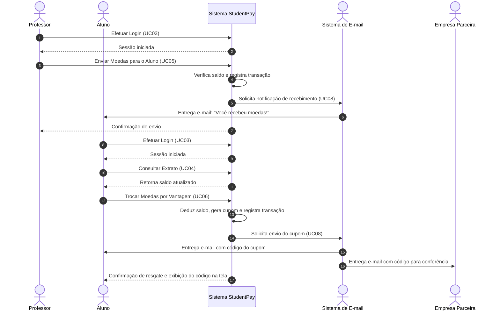

### Diagrama de Sequência Geral - Fluxo Principal

```mermaid
sequenceDiagram
    autonumber
    actor P as Professor
    actor A as Aluno
    participant S as Sistema StudentPay
    actor Mail as Sistema de E-mail
    actor E as Empresa Parceira
    
    %% Fase 1: Envio de Moedas pelo Professor
    P->>S: Efetuar Login (UC03)
    S-->>P: Sessão iniciada
    
    P->>S: Enviar Moedas para o Aluno (UC05)
    S->>S: Verifica saldo e registra transação
    S->>Mail: Solicita notificação de recebimento (UC08)
    Mail->>A: Entrega e-mail: "Você recebeu moedas!"
    S-->>P: Confirmação de envio
    
    %% Fase 2: Resgate de Vantagem pelo Aluno
    A->>S: Efetuar Login (UC03)
    S-->>A: Sessão iniciada
    
    A->>S: Consultar Extrato (UC04)
    S-->>A: Retorna saldo atualizado
    
    A->>S: Trocar Moedas por Vantagem (UC06)
    S->>S: Deduz saldo, gera cupom e registra transação
    S->>Mail: Solicita envio do cupom (UC08)
    Mail->>A: Entrega e-mail com código do cupom
    Mail->>E: Entrega e-mail com código para conferência
    S-->>A: Confirmação de resgate e exibição do código na tela
```
