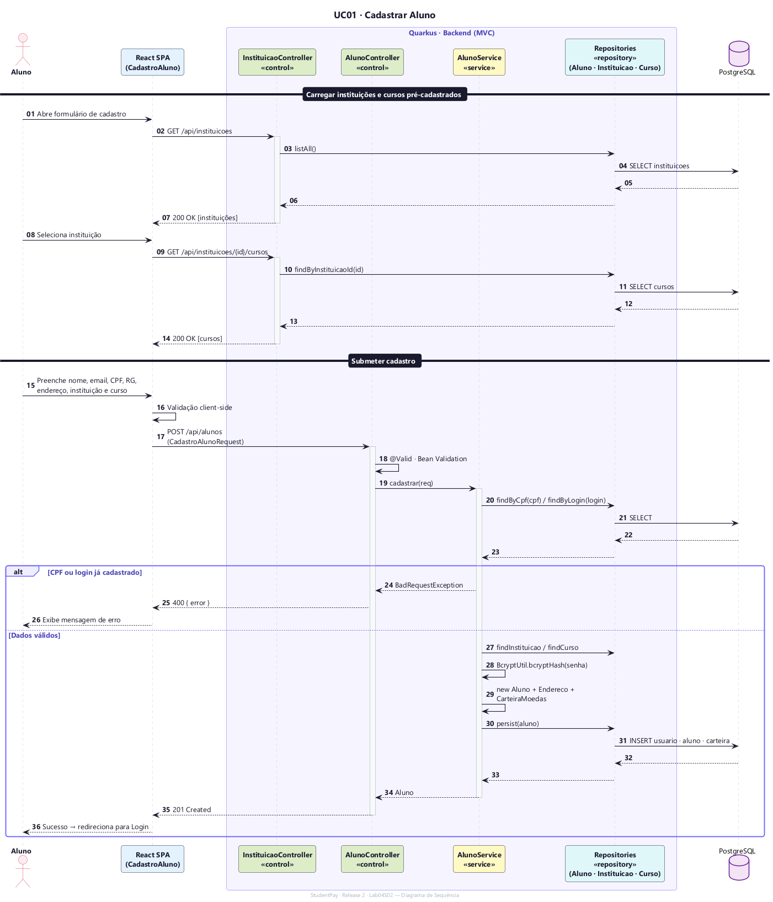
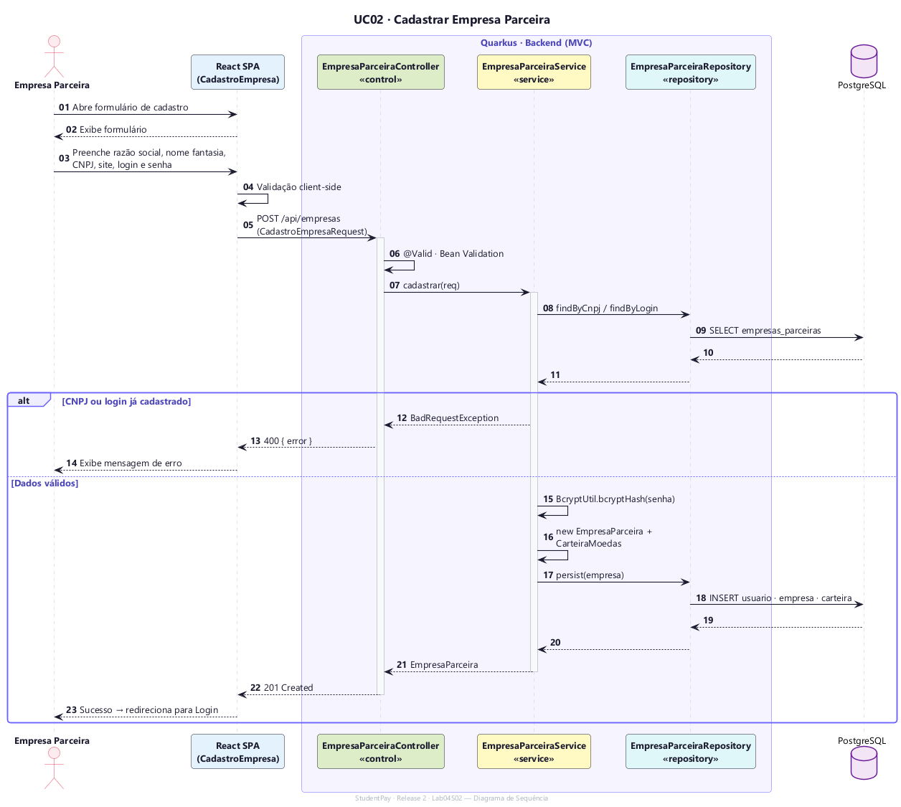
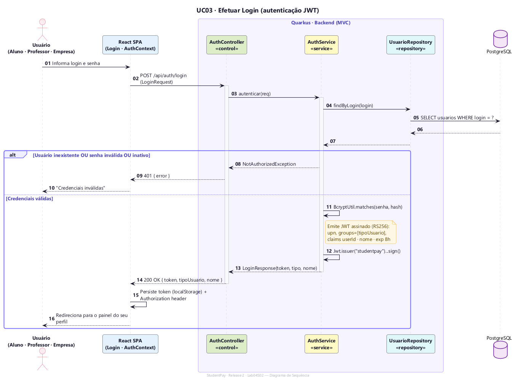
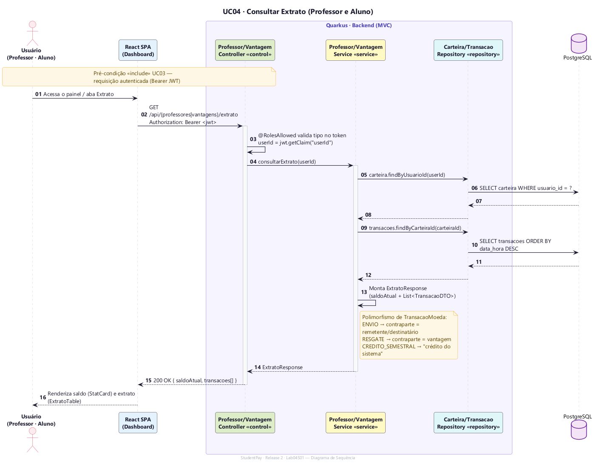
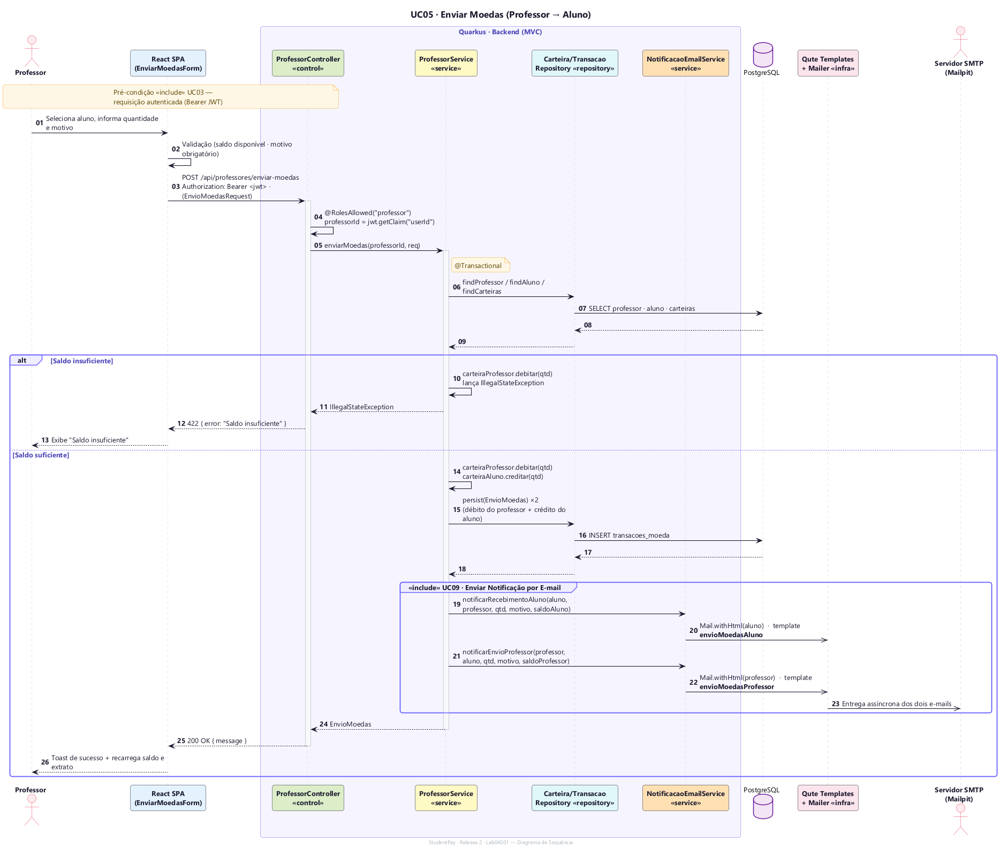
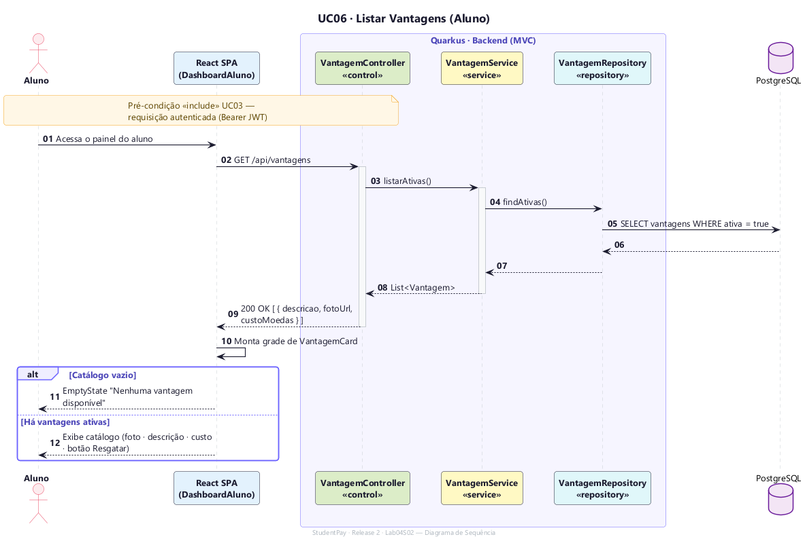
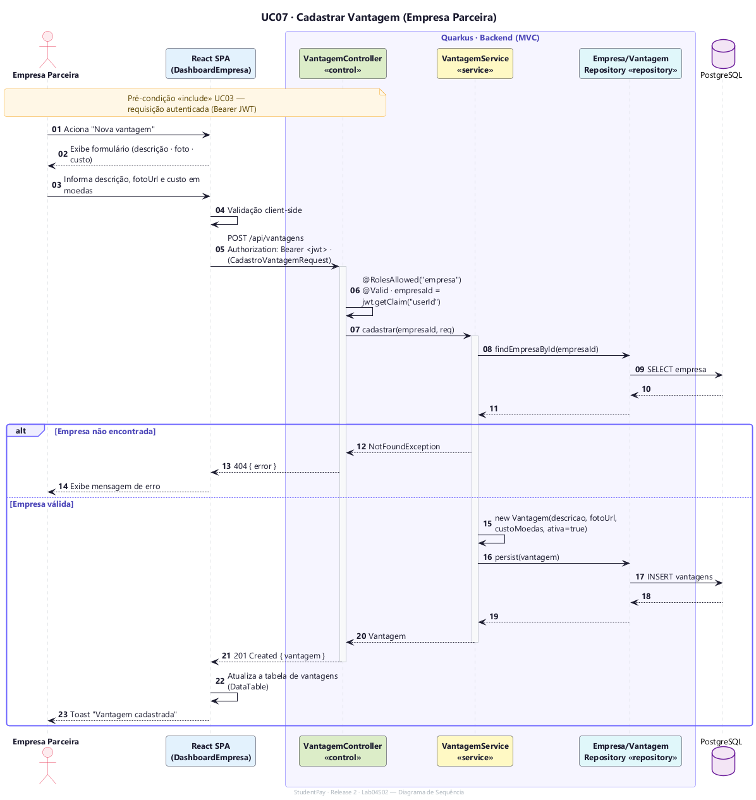
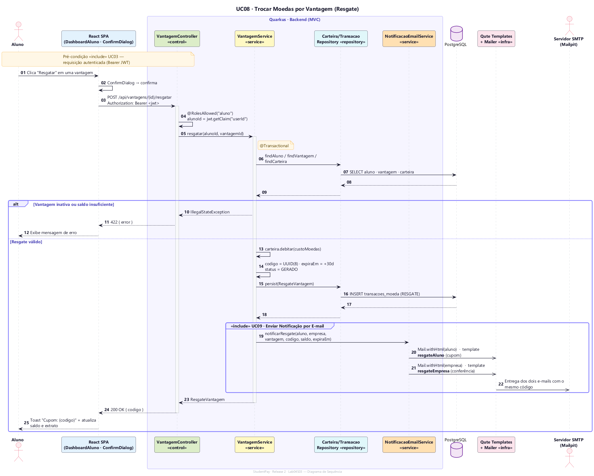
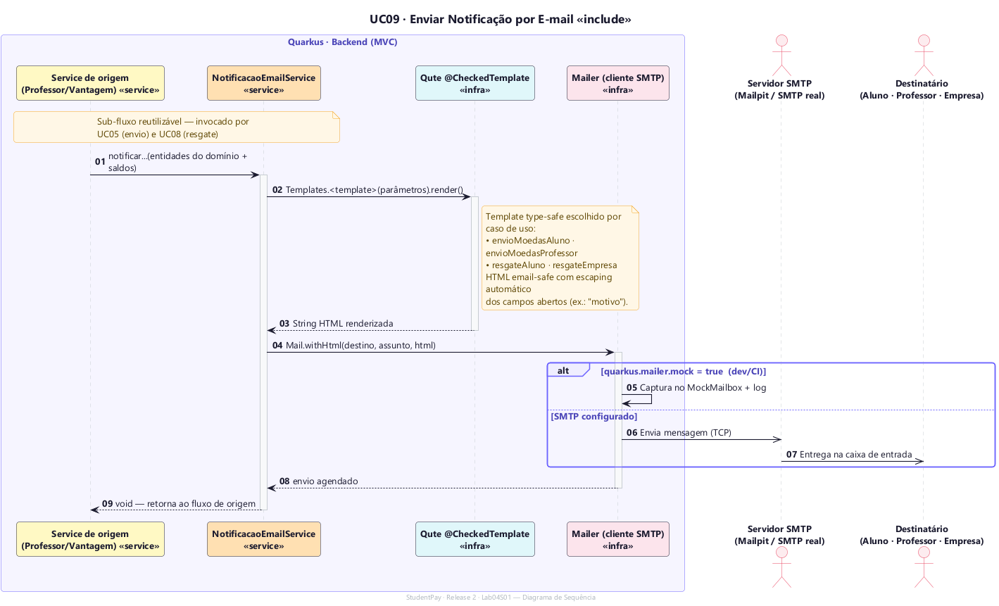

# Diagramas de Sequência — StudentPay (Release 2 · Lab04S02)

Um diagrama de sequência **por caso de uso**, modelados em **PlantUML** e
**alinhados ao código real** (critério de avaliação da Release 2: *alinhamento
entre modelo e código*). Em vez de tratar o backend como uma caixa-preta
("Sistema"), cada diagrama percorre as **camadas MVC** efetivamente
implementadas no Quarkus:

```
React SPA  →  Controller (JAX-RS)  →  Service (@Transactional)  →  Repository (Panache)  →  PostgreSQL
                                              └→ NotificacaoEmailService → Qute (@CheckedTemplate) → Mailer → SMTP
```

> **Fontes** (`.puml`) e imagens renderizadas (`out/`) ficam em
> [`sequence/`](./sequence/). Para regenerar, veja [como renderizar](#-como-regenerar).

## 🎨 Legenda

| Camada | Cor | Exemplos no código |
|--------|-----|--------------------|
| View (SPA React) | 🟦 azul | `pages/`, `components/` |
| Controller `«control»` | 🟩 verde | `AuthController`, `ProfessorController`, `VantagemController` |
| Service `«service»` | 🟨 amarelo | `AuthService`, `ProfessorService`, `VantagemService` |
| Notificação `«service»` | 🟧 laranja | `NotificacaoEmailService` |
| Repository `«repository»` | 🟦 ciano | `*Repository` (Panache) |
| Banco / Infra | 🟪 roxo / 🌸 rosa | `PostgreSQL`, `Qute + Mailer`, `SMTP` |

Convenção de setas: `→` chamada síncrona · `-->` retorno · `->>` mensagem
assíncrona (entrega de e-mail). Blocos `alt/else` representam caminhos
alternativos (erros, validações) e `group «include»` representa inclusão de
outro caso de uso.

---

## 📑 Casos de uso

| # | Caso de uso | Sprint | Fonte |
|---|-------------|--------|-------|
| UC01 | Cadastrar Aluno | R1 | [`uc01`](./sequence/uc01-cadastrar-aluno.puml) |
| UC02 | Cadastrar Empresa Parceira | R1 | [`uc02`](./sequence/uc02-cadastrar-empresa.puml) |
| UC03 | Efetuar Login (JWT) | R1 | [`uc03`](./sequence/uc03-efetuar-login.puml) |
| UC04 | Consultar Extrato | **Lab04S01** | [`uc04`](./sequence/uc04-consultar-extrato.puml) |
| UC05 | Enviar Moedas | **Lab04S01** | [`uc05`](./sequence/uc05-enviar-moedas.puml) |
| UC06 | Listar Vantagens | **Lab04S02** | [`uc06`](./sequence/uc06-listar-vantagens.puml) |
| UC07 | Cadastrar Vantagem | **Lab04S02** | [`uc07`](./sequence/uc07-cadastrar-vantagem.puml) |
| UC08 | Trocar Moedas por Vantagem (Resgate) | Lab04S03 | [`uc08`](./sequence/uc08-resgatar-vantagem.puml) |
| UC09 | Enviar Notificação por E-mail `«include»` | **Lab04S01** | [`uc09`](./sequence/uc09-enviar-notificacao.puml) |

---

### UC01 · Cadastrar Aluno
Carrega instituições/cursos pré-cadastrados, valida duplicidade de CPF e login,
aplica *hash* BCrypt e cria `Aluno` + `Endereco` + `CarteiraMoedas`.



### UC02 · Cadastrar Empresa Parceira
Cadastro da empresa (CNPJ, nome fantasia, site) com carteira própria.



### UC03 · Efetuar Login (JWT)
Autenticação *stateless*: verificação BCrypt e emissão de **JWT** assinado
(RS256) com `userId`, `nome` e `groups = [tipoUsuario]`.



### UC04 · Consultar Extrato — *Lab04S01*
Saldo + histórico polimórfico de `TransacaoMoeda` (envio, resgate, crédito
semestral) para professores e alunos.



### UC05 · Enviar Moedas — *Lab04S01*
Operação `@Transactional`: debita o professor, credita o aluno, registra duas
transações e dispara **dois e-mails** — recebimento (aluno) e comprovante
(professor), cada um com seu template dedicado.



### UC06 · Listar Vantagens — *Lab04S02*
Catálogo de vantagens ativas exibido ao aluno como grade de `VantagemCard`.



### UC07 · Cadastrar Vantagem — *Lab04S02*
Empresa parceira cadastra uma vantagem (descrição, foto, custo em moedas).



### UC08 · Trocar Moedas por Vantagem (Resgate) — *Lab04S03*
Debita o saldo do aluno, gera cupom único com validade e notifica aluno (cupom)
e empresa (conferência) com o mesmo código.



### UC09 · Enviar Notificação por E-mail `«include»` — *Lab04S01*
Sub-fluxo reutilizável invocado por UC05 e UC08. Renderiza um template Qute
type-safe e envia via `Mailer` (ou `MockMailbox` em desenvolvimento).



---

## 🔁 Como regenerar

Os PNG/SVG em [`sequence/out/`](./sequence/) são gerados a partir dos `.puml`:

```bash
cd diagrams/sequence
# requer Java + plantuml.jar (https://plantuml.com/download)
java -jar plantuml.jar -charset UTF-8 -tpng -o out uc*.puml geral.puml
java -jar plantuml.jar -charset UTF-8 -tsvg -o out uc*.puml geral.puml
```

O tema visual compartilhado fica em [`sequence/_style.puml`](./sequence/_style.puml)
(incluído por todos os diagramas via `!include`).

> O **Diagrama de Sequência Geral** (Lab04S03) está em
> [`sequence_diagram.md`](./sequence_diagram.md).
