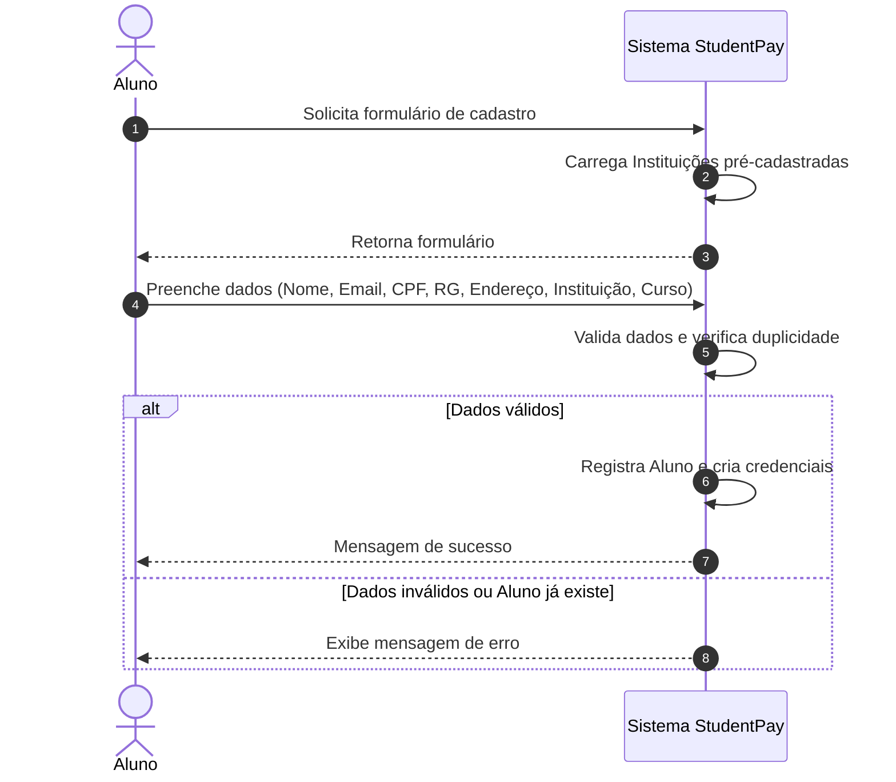
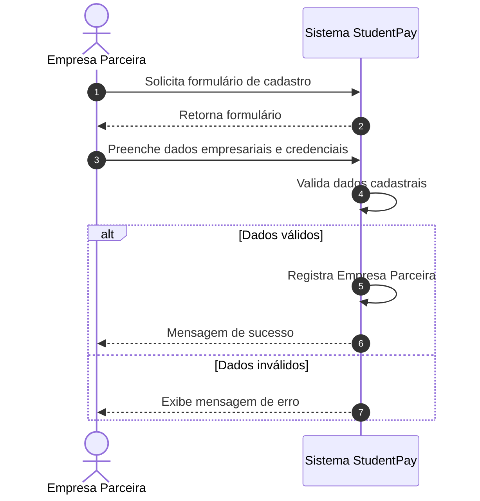
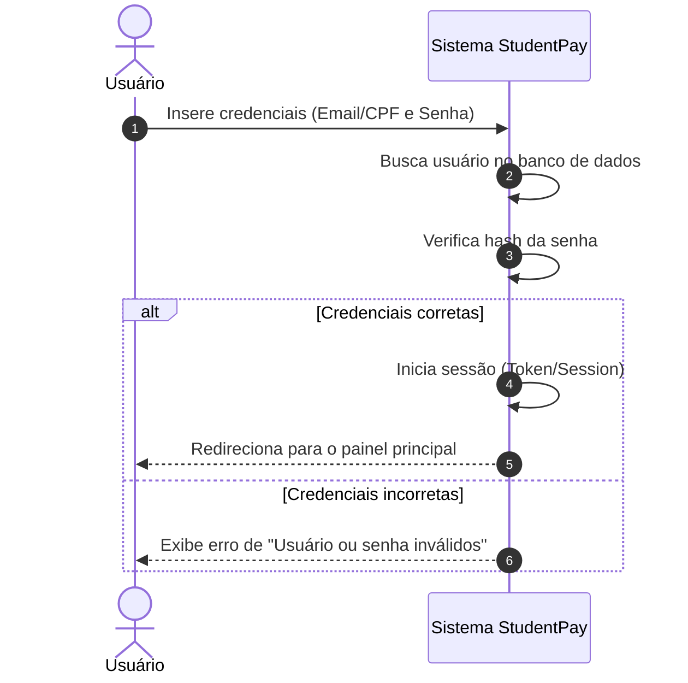
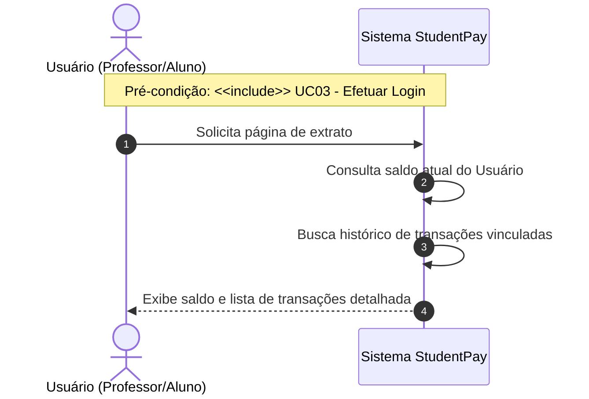
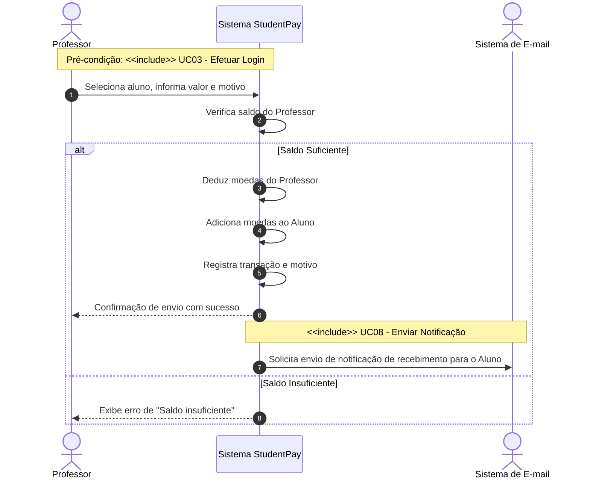
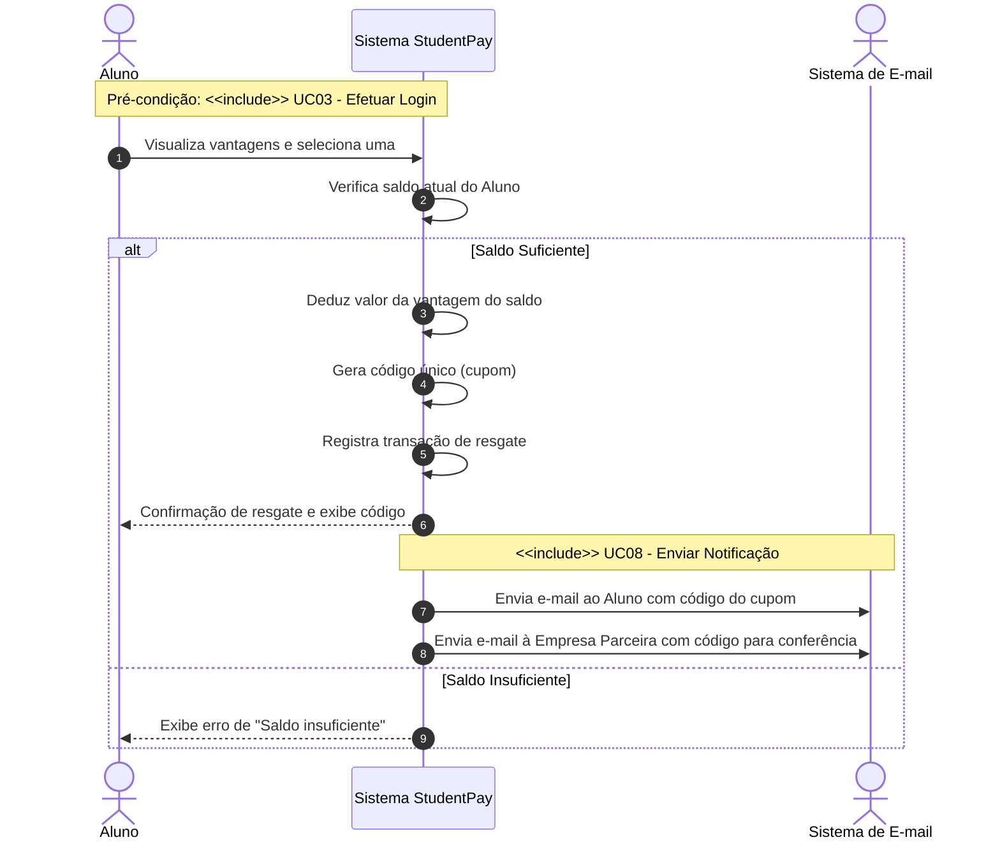
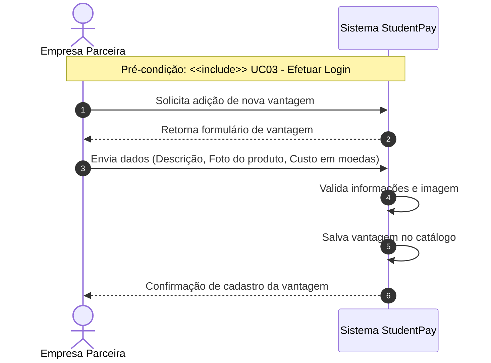
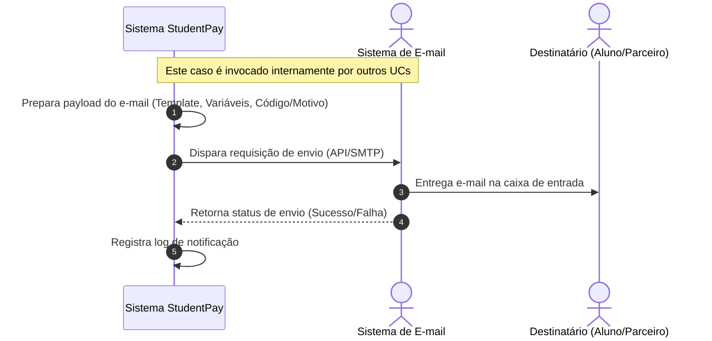
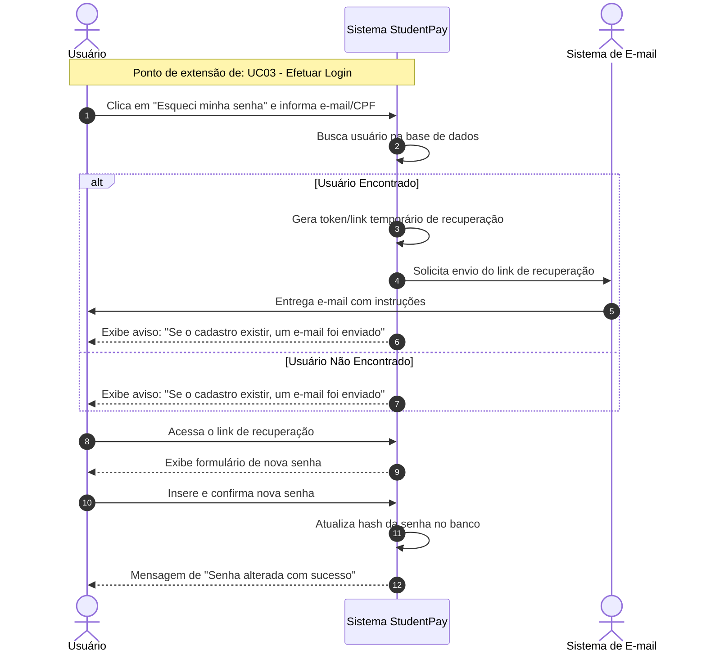

### UC01 - Cadastrar Aluno

--------------------------------------------------------------------------------------------------------------
### UC02 - Cadastrar Empresa

-----------------------------------------------------------------------------------------------------------------
### UC03 - Efetuar Login

-----------------------------------------------------------------------------------------------------------------

### UC04 - Consultar Extrato

-----------------------------------------------------------------------------------------------------------------
### UC05 - Enviar Moedas

-----------------------------------------------------------------------------------------------------------------

### UC06 - Trocar Moedas por Vantagem

-----------------------------------------------------------------------------------------------------------------

### UC07 - Cadastrar Vantagem

-----------------------------------------------------------------------------------------------------------------

### UC08 - Enviar Notificação por E-mail

-----------------------------------------------------------------------------------------------------------------

### UC09 - Recuperar Senha

    
